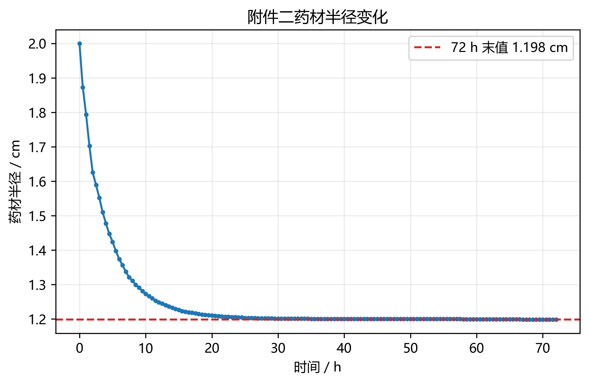
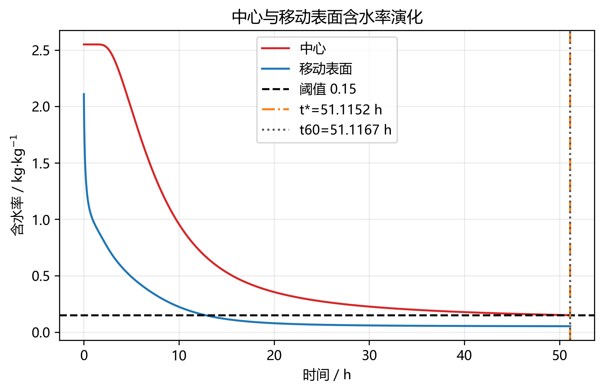
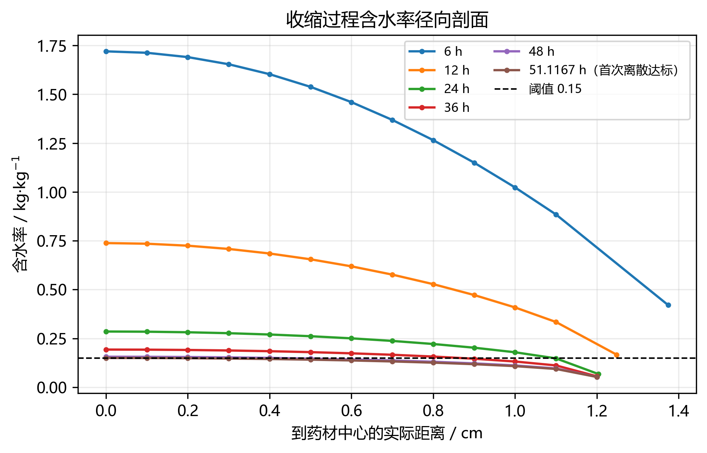
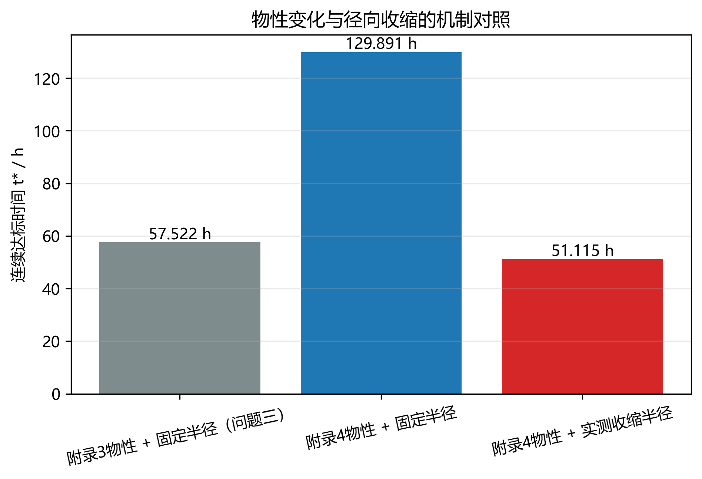

# 问题四  考虑径向收缩的移动边界干燥模型

## 1. 问题分析

问题三在固定半径条件下预测了药材全域含水率的达标时间。实际干燥过程中，药材半径随水分流失而减小，内部扩散距离和表面边界位置均随时间变化。问题四还给出了不同于问题三的热物性和水分扩散系数。因此，问题三和问题四之间的时间差同时包含物性公式变化与几何收缩两种作用，不能全部解释为收缩效应。

附件二只给出了药材半径随时间的观测值，没有给出内部位移场和轴向尺寸。本文保持药材长度为 $25\ \mathrm{cm}$，将实测半径用于确定移动表面，并采用均匀比例径向收缩假设封闭内部材料速度。随后通过归一化材料坐标把变化区域转换到固定参考域，在该参考域上求解温度和干基含水率。

## 2. 模型假设

1. 药材仍视为均匀、各向同性的连续多孔介质，主模型描述圆柱中部截面的径向传递过程。
2. 药材长度保持 $25\ \mathrm{cm}$，仅考虑附件二直接观测到的径向收缩。
3. 内部各材料点按相同比例径向移动，材料速度为 $v(r,t)=r\dot R(t)/R(t)$。该式是根据边界运动补充的闭合假设，不是附件二能够唯一确定的内部速度场。
4. $C$ 仍为干基含水率，附录四给出的 $D(C,T)$ 视为与该变量配套的有效扩散系数。
5. $\rho(C)$ 只用于温度方程的显热储存项，水分方程继续采用题给有效扩散形式，不将密度机械乘入水分方程。
6. 对流换热系数和传质系数沿用前三问，即 $h=25\ \mathrm{W/(m^2\cdot K)}$、$h_m=8\times10^{-7}\ \mathrm{m/s}$。这是题目未重新给出边界参数时的延续假设。
7. 不额外引入相变潜热、温度梯度导湿、应力和应变方程，以免增加无法由题给数据标定的参数。

## 3. 半径函数与长期环境边界

附件二包含 $0\sim72\ \mathrm h$ 的 145 个半径观测点，采样间隔为 $1800\ \mathrm s$。半径由初始的 $2.000\ \mathrm{cm}$ 单调减小至 $1.198\ \mathrm{cm}$，总径向收缩率为

\[
\frac{2.000-1.198}{2.000}\times100\%=40.1\%.
\]

观测半径采用分段线性插值：

\[
R(t)=R_i+\frac{R_{i+1}-R_i}{t_{i+1}-t_i}(t-t_i),
\qquad t_i\le t\le t_{i+1}.
\]

若计算超过 72 h，则保持 $R(t)=1.198\ \mathrm{cm}$。本问基准计算在约 51.1 h 已达到阈值，因此实际没有使用 72 h 之后的半径外推。

烘房环境沿用问题三的处理：前 4 h 对附件一数据进行分段线性插值，4 h 后采用最后 1 h 的样本均值

\[
T_\infty=49.9989344\ ^\circ\mathrm C,
\qquad
C_\infty=0.0499875410\ \mathrm{kg/kg}.
\]

## 4. 移动边界控制方程

### 4.1 附录四物性关系

问题四采用附录四给出的经验公式：

\[
\rho(C)=760+90C,
\]

\[
c_p(C)=1850+2150\frac{C}{C+1},
\]

\[
k(C)=0.12+0.20\frac{C}{C+1},
\]

\[
D(C,T_K)=4.2\times10^{-4}
\exp\left(-\frac{0.30}{C}\right)
\exp\left(-\frac{3850}{T_K}\right),
\qquad T_K=T+273.15.
\]

### 4.2 实验室坐标中的材料运动

设 $0\le r\le R(t)$。在材料以速度 $v(r,t)$ 收缩的条件下，温度和干基含水率方程写为

\[
\rho(C)c_p(C)
\left(\frac{\partial T}{\partial t}
+v\frac{\partial T}{\partial r}\right)
=\frac1r\frac{\partial}{\partial r}
\left[rk(C)\frac{\partial T}{\partial r}\right],
\]

\[
\frac{\partial C}{\partial t}
+v\frac{\partial C}{\partial r}
=\frac1r\frac{\partial}{\partial r}
\left[rD(C,T)\frac{\partial C}{\partial r}\right].
\]

采用均匀比例收缩假设

\[
v(r,t)=\frac{\dot R(t)}{R(t)}r,
\]

可保证表面速度满足 $v(R,t)=\dot R(t)$。移动边界干燥研究表明，仅给定表面位置不能唯一确定内部材料速度，需要同时说明材料运动、扩散通量和边界运动之间的关系[1]。本文的比例速度场是结合题给半径数据采用的最简闭合。

### 4.3 固定参考域变换

引入归一化材料坐标

\[
\xi=\frac{r}{R(t)},\qquad 0\le\xi\le1.
\]

对任意场变量 $\phi(r,t)=\widehat\phi(\xi,t)$，有

\[
\left.\frac{\partial\phi}{\partial t}\right|_r
=\left.\frac{\partial\widehat\phi}{\partial t}\right|_\xi
-\frac{\dot R}{R}\xi\frac{\partial\widehat\phi}{\partial\xi},
\qquad
v\frac{\partial\phi}{\partial r}
=\frac{\dot R}{R}\xi\frac{\partial\widehat\phi}{\partial\xi}.
\]

两项相消后，控制方程变为

\[
\boxed{
\rho(C)c_p(C)\frac{\partial T}{\partial t}
=\frac{1}{R^2(t)\xi}
\frac{\partial}{\partial\xi}
\left[\xi k(C)\frac{\partial T}{\partial\xi}\right]
},
\]

\[
\boxed{
\frac{\partial C}{\partial t}
=\frac{1}{R^2(t)\xi}
\frac{\partial}{\partial\xi}
\left[\xi D(C,T)\frac{\partial C}{\partial\xi}\right]
}.
\]

这里没有遗漏收缩输运项。由于参考网格按 $v=r\dot R/R$ 与材料同步移动，材料对流项已经包含在坐标变换中；若再次加入相同的对流项，反而会重复计算材料运动。

### 4.4 初始条件与边界条件

初始条件为

\[
T(\xi,0)=28\ ^\circ\mathrm C,
\qquad C(\xi,0)=2.55\ \mathrm{kg/kg}.
\]

中心满足对称条件

\[
\left.\frac{\partial T}{\partial\xi}\right|_{\xi=0}=0,
\qquad
\left.\frac{\partial C}{\partial\xi}\right|_{\xi=0}=0.
\]

移动表面 $\xi=1$ 满足

\[
-\frac{k(C_s)}{R(t)}
\left.\frac{\partial T}{\partial\xi}\right|_{\xi=1}
=h[T_s-T_\infty(t)],
\]

\[
-\frac{D(C_s,T_s)}{R(t)}
\left.\frac{\partial C}{\partial\xi}\right|_{\xi=1}
=h_m[C_s-C_\infty(t)].
\]

## 5. 数值求解

### 5.1 参考域有限体积离散

将固定参考域划分为 $N=320$ 个单元，

\[
\Delta\xi=\frac1{320}=0.003125.
\]

时间步长取 $\Delta t=30\ \mathrm s$，每 60 s 输出一次。对一般变量 $\phi$，第 $i$ 个参考控制体的后向 Euler 格式为

\[
s_iV_i^\xi\frac{\phi_i^{n+1}-\phi_i^n}{\Delta t}
=G_{i-1/2}^{n+1}(\phi_{i-1}^{n+1}-\phi_i^{n+1})
+G_{i+1/2}^{n+1}(\phi_{i+1}^{n+1}-\phi_i^{n+1}),
\]

其中

\[
V_i^\xi=\frac12
\left(\xi_{i+1/2}^2-\xi_{i-1/2}^2\right),
\qquad
G_{i+1/2}=\frac{\xi_{i+1/2}\Gamma_{i+1/2}}
{R^2(t)\Delta\xi}.
\]

温度方程取 $s_i=\rho c_p,\ \Gamma=k$，水分方程取 $s_i=1,\ \Gamma=D$。界面物性使用调和平均[4]，离散后形成三对角方程组。

### 5.2 移动表面的半单元阻力

最外层单元中心与真实表面的实际距离为 $R(t)\Delta\xi/2$。内部传递阻力与外部对流阻力串联后，等效边界系数为

\[
\beta_{\mathrm{eff}}
=\left[
\frac1\beta+\frac{R(t)\Delta\xi}{2\Gamma_s}
\right]^{-1}.
\]

在参考域守恒方程中，对应的表面导通系数为 $\beta_{\mathrm{eff}}/R(t)$。该处理会随半径同步更新表面半单元的实际厚度。

### 5.3 非线性迭代、重构和终止条件

每个时间步采用欠松弛 Picard 迭代，同时更新 $T,C$ 及相关物性，停止准则为

\[
\max_i\frac{|u_i^{(m+1)}-u_i^{(m)}|}
{1+|u_i^{(m+1)}|}<10^{-9}.
\]

题目模板中的固定物理位置 $r_j$ 通过

\[
\xi_j(t)=\frac{r_j}{R(t)}
\]

映射到参考域；最后一列“药材表面”直接取 $\xi=1$ 的重构值。程序在每个内部时间步检查全部单元和重构节点，定义

\[
C_{\max}(t)=\max_{0\le\xi\le1}C(\xi,t).
\]

当相邻时间层满足 $C_{\max}^{n}\ge0.15>C_{\max}^{n+1}$ 时进行线性插值，得到连续临界时刻 $t_*$；同时记录首次满足严格小于 $0.15$ 的 60 s 输出时刻 $t_{60}$。

## 6. 计算结果

### 6.1 全域烘干结束时间

按照题目每隔 60 s 保存完整结果的要求，以输出序列中药材各处含水率首次严格低于 $0.15\ \mathrm{kg/kg}$ 的时刻作为正式烘干结束时间：

\[
\boxed{t_{\mathrm{end}}=t_{60}=51.1167\ \mathrm h}
\qquad (184020\ \mathrm s).
\]

此时药材半径为 $1.2000\ \mathrm{cm}$，中心含水率为 $0.1499972281\ \mathrm{kg/kg}$，移动表面含水率为 $0.0526072221\ \mathrm{kg/kg}$，全域均满足题目要求。全过程数值检查表明含水率沿半径单调不增，全域最大值始终位于中心；这是计算结果，而不是终止判据预先采用的假设。

为说明临界时刻的内部定位精度，在相邻 30 s 计算时间层之间线性插值得到 $t_*=51.1152\ \mathrm h$（$184014.6\ \mathrm s$），与正式结束时间仅相差约 $5.4\ \mathrm s$。该值用于数值分析，不作为另一组烘干结束时间。

### 6.2 不同时刻的含水率

表 6 给出题目要求的代表位置结果。药材表面位置随 $R(t)$ 改变，表中“表面”列始终表示当时的真实移动表面。

### 表 6  考虑收缩时药材烘干过程的干基含水率（$\mathrm{kg/kg}$）

| 时间 / h | 0 cm | 0.5 cm | 1.0 cm | 药材表面 |
|---:|---:|---:|---:|---:|
| 6 | 1.7195 | 1.5378 | 1.0228 | 0.4208 |
| 12 | 0.7381 | 0.6550 | 0.4085 | 0.1671 |
| 18 | 0.4090 | 0.3689 | 0.2399 | 0.0892 |
| 24 | 0.2853 | 0.2612 | 0.1791 | 0.0673 |
| 30 | 0.2264 | 0.2095 | 0.1493 | 0.0595 |
| 36 | 0.1929 | 0.1797 | 0.1317 | 0.0560 |
| 42 | 0.1713 | 0.1604 | 0.1200 | 0.0541 |
| 48 | 0.1562 | 0.1469 | 0.1116 | 0.0530 |
| 51.1167 | 0.1500 | 0.1413 | 0.1081 | 0.0526 |

注：末行中心含水率未四舍五入前为 $0.1499972281\ \mathrm{kg/kg}$，满足严格小于 $0.15$ 的判定。每 60 s、固定位置 $0,0.1,\ldots,1.1\ \mathrm{cm}$ 及移动表面的完整结果保存在 `附件/附件3/result4.xlsx`。

## 7. 物性变化与收缩效应的拆分

为避免把问题三到问题四的全部时间差误认为收缩作用，设置三组对照。下表统一采用连续临界时间，以消除 60 s 取整的影响，仅用于拆分物性变化与收缩效应，不作为问题四的另一组答案。

| 工况 | 物性公式 | 半径 | 机制比较用连续临界时间 $t_*$ / h |
|---|---|---|---:|
| A：问题三基准 | 附录三 | 固定 $2\ \mathrm{cm}$ | 57.5224 |
| B：物性变化对照 | 附录四 | 固定 $2\ \mathrm{cm}$ | 129.8906 |
| C：问题四完整模型 | 附录四 | 实测 $R(t)$ | 51.1152 |

在相同固定半径下，附录四使达标时间相对附录三增加 $72.3682\ \mathrm h$。两套扩散系数之比为

\[
\frac{D_4}{D_3}
=0.175\exp\left(\frac{0.15}{C}\right).
\]

在本题主要含水率范围内，附录四的扩散系数整体较小，因此固定半径对照明显变慢。保持附录四物性不变，再引入实测收缩半径，达标时间由 $129.8906\ \mathrm h$ 降至 $51.1152\ \mathrm h$，收缩净效应为缩短 $78.7755\ \mathrm h$。这是由于半径最终接近 $1.2\ \mathrm{cm}$，参考域扩散算子中的 $1/R^2(t)$ 明显增大，内部扩散距离同步缩短。

综合两项变化，问题四完整结果比问题三缩短 $6.4072\ \mathrm h$。因此，问题四的较短达标时间是“较慢的附录四物性”和“显著缩短的扩散路径”共同作用后的净结果。

## 8. 数值检验

### 8.1 固定半径退化检验

令 $R(t)\equiv R_0$ 后，参考域控制体体积、内部导通系数和表面导通系数分别与固定物理域离散量相差统一因子 $R_0^{-2}$，所得三对角方程组解与固定域有限体积格式一致。这表明当前实现能够在无收缩条件下正确退化，而不是另行构造一套不可比较的离散模型。

### 8.2 网格与时间步长独立性检验

| 计算设置 | $N$ | $\Delta t$ / s | $t_*$ / h | 相对基准变化 |
|---|---:|---:|---:|---:|
| 基准 | 320 | 30 | 51.115167 | 基准 |
| 空间加密 | 640 | 30 | 51.113009 | $-7.77\ \mathrm s$ |
| 时间加密 | 320 | 15 | 51.105700 | $-34.08\ \mathrm s$ |

空间加密和时间加密引起的连续临界时间相对变化分别约为 $0.0042\%$ 和 $0.0185\%$。两种加密情况下，正式的 60 s 烘干结束时刻均仍为 $51.1167\ \mathrm h$，表明主要结论对当前网格和时间步长不敏感。

### 8.3 参考域收支检验

定义参考域积分量

\[
I_C(t)=\int_0^1 C(\xi,t)\xi\,\mathrm d\xi.
\]

将其减少量与表面累计离散通量比较，基准、空间加密和时间加密计算的累计相对不平衡分别为

\[
8.72\times10^{-7},\qquad
8.40\times10^{-7},\qquad
1.89\times10^{-6}.
\]

基准计算的最大单步相对残差为 $4.05\times10^{-10}$。这些结果说明移动参考域有限体积离散在代数层面保持良好的收支闭合，但不能替代对含水率变量物理口径和边界参数的实验确认。

## 9. 模型局限

1. 附件二只确定表面半径，内部比例速度场是必要的附加假设。真实药材可能存在非均匀收缩、开裂或局部塌陷。
2. 模型保持长度不变，也未计算端面传热传质。已有一维与二维移动边界比较表明，几何尺寸比会影响降维模型的预测[3]；初始长径比 $L/R=12.5$ 不能直接套用文献中特定条件下的误差阈值。
3. $\rho(C)$ 按题给经验式作为有效热储存参数使用，未利用其反演干物质体积密度或结构变形。已有圆柱蔬菜干燥研究可以进一步耦合流动、传质和结构力学[2]，但本题已有半径观测且缺少应力参数，不宜直接照搬完整模型。
4. $h,h_m$ 和长期环境平台均沿用前三问。若这些边界参数随风速、装载密度或收缩表面积发生变化，达标时间也会改变。
5. 附件一第三列继续作为题设等效外界水分变量使用；若其实际为空气湿度比，还需增加吸附等温线完成变量转换。

## 10. 结论

本文依据附件二的实测半径建立了一维径向移动边界模型，并通过归一化材料坐标将变化求解域转换为固定参考域。按照题目 60 s 输出规程，药材各处含水率首次严格低于 $0.15\ \mathrm{kg/kg}$ 的正式烘干结束时间为 **$51.1167\ \mathrm h$**（$184020\ \mathrm s$），此时半径约为 $1.2000\ \mathrm{cm}$。连续插值时间 $51.1152\ \mathrm h$ 仅作为辅助定位结果。

三组连续时间对照表明，若只更换附录四物性而保持固定半径，临界时间为 $129.8906\ \mathrm h$；加入实测径向收缩后降至 $51.1152\ \mathrm h$。这些数值用于分析物性与收缩的作用，不是额外的烘干结束时间。不能孤立地用问题三与问题四的总时间差衡量收缩作用，应在相同物性条件下比较固定半径与移动半径结果。

固定半径退化检验表明移动域模型可正确退化为固定域格式；空间和时间加密引起的连续临界时间相对变化均小于 $0.02\%$，三种计算的累计含水率收支不平衡度均小于 $2\times10^{-6}$，且正式结束时刻保持为 $51.1167\ \mathrm h$。这些检验说明结果具有较好的数值稳定性和内部一致性，但由于缺少药材内部含水率实测数据，尚不能替代实验验证。

## 参考文献

[1] ADROVER A, BRASIELLO A, PONSO G. A moving boundary model for food isothermal drying and shrinkage: General setting[J]. Journal of Food Engineering, 2019, 244: 178-191.

[2] CURCIO S, AVERSA M. Influence of shrinkage on convective drying of fresh vegetables: A theoretical model[J]. Journal of Food Engineering, 2014, 123: 36-49.

[3] ADROVER A, BRASIELLO A. A moving boundary model for food isothermal drying and shrinkage: One-dimensional versus two-dimensional approaches[J]. Journal of Food Process Engineering, 2019, 42(6): e13178.

[4] PATANKAR S V. Numerical Heat Transfer and Fluid Flow[M]. New York: Hemisphere Publishing Corporation, 1980.
